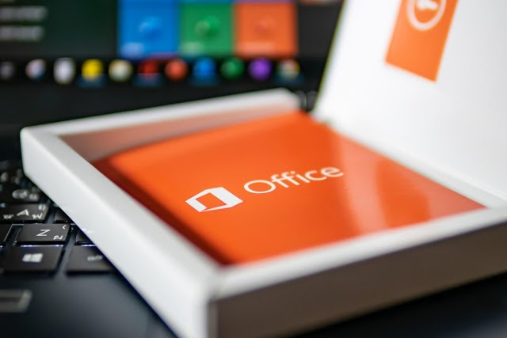

# óffice.com/setup 

Put brilliant Óffice apps into use to perform faster in the business world and enhance productivity. We have shared the precise process below to download, install and activate your Óffice product from óffice.com/setup. Follow the instructions that we have mentioned below.

## How to Download MS Óffice from Óffice.com/setup

If one encounters any problems downloading the setup file from óffice.com/setup, the user can quickly go through the described process.We have shared the detailed procedure on the page. Execute the steps in the described manner.

1. First, you need to connect a computer to a good internet connection.
2. After establishing a proper connection for your computer and the stable internet, open any latest web browser version on your computer and go to óffice.com/setup.
3. Doing these steps will take you to the sign-in page. You need to enter the correct credentials in the required manner.
4. If you plan to create a new Óffice account, you need to select the Sign-up option.
5. You need to select Microsoft Home to reach the Microsoft homepage quickly.
6. After that, select the Install Óffice.
7. Click the Install.
8. Wait patiently and allow the downloading process to finish.

## How to Install Microsoft Óffice

We have explained the step-by-step procedure to download MS Óffice from óffice.com/setup, implement the installation process with these steps.

1. When you download the Óffice setup from the site óffice.com/setup, you need to run the Óffice installer to begin the installation.
2. On your system folder, you are to locate the Óffice setup file.
3. Double-click it and keep waiting until the installation is complete.
4. When the installation reaches a conclusion, the “You're all set! MS Óffice is installed!” message will appear on the screen.
5. Click the Install Óffice.
6. After that, you need to click the Install.
7. That is how you can quickly put the installation to an end.

## How to Activate MS Óffice on Windows and Mac Device

When you have completed the downloading and installation at the website óffice.com/setup, you should carry out the activation. Follow the straightforward method shared below:

1. As a Windows device user, press the Win key on the keyboard.
2. Type an Óffice app name in the search bar.
3. When you open the app, you will see the license agreement on the screen.
4. Click the Accept to accept the license agreement on the screen.
5. MS Óffice is activated on Windows PC.
6. Mac users should select Dock and then click the Launchpad icon.
7. Open any Óffice app.
8. When you launch an Óffice app for the first time, you will see the What’s New window.
9. Get started with the activated Óffice version on your Mac.

## How to Upgrade Óffice Subscription Quickly at Óffice.com/setup

If you face any complexities while upgrading your Óffice subscription, you can reach óffice.com/setup and implement the steps shared below. Below is the straightforward process for you. Follow the instructions:

1. Connect your system to the internet and go to óffice.com/setup.
2. Select the sign-in.
3. Log in to your registered Óffice account with the right credentials.
4. After that, you should click on the My Microsoft Account.
5. Next, you have to select Subscriptions.
6. Choose any MS Óffice subscription you want to switch to.
7. That is how anyone can upgrade to an Óffice subscription easily at óffice.com/setup.
